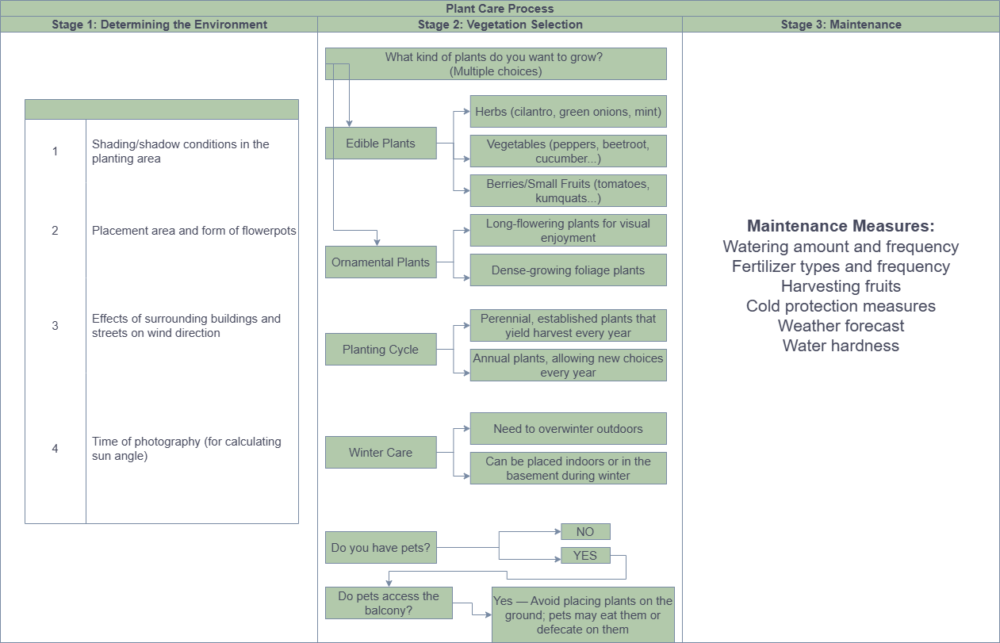
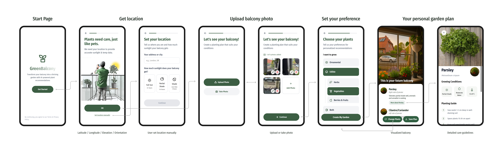
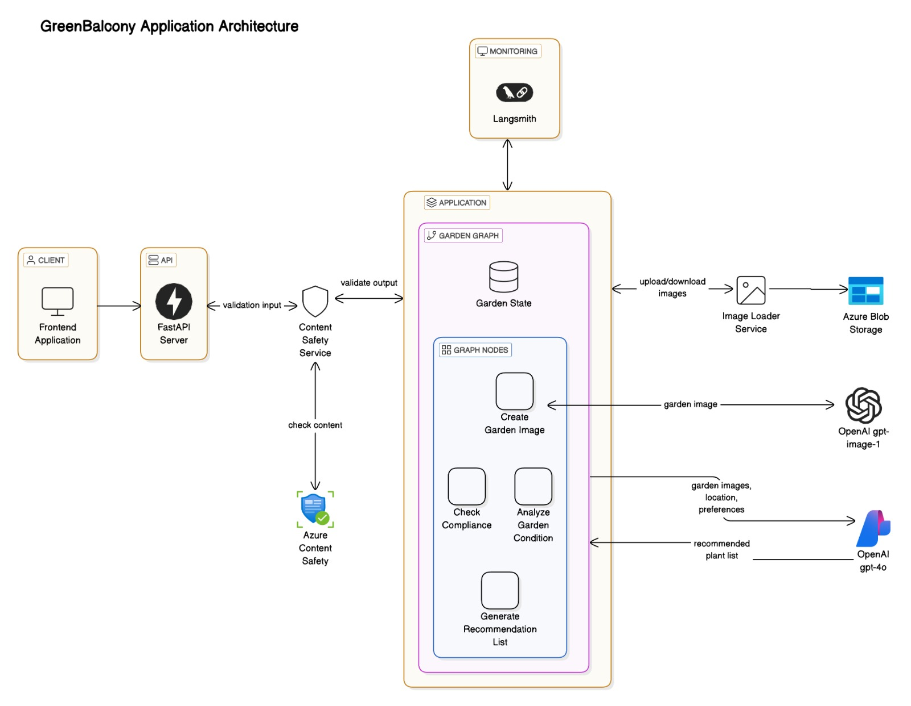

# 🌱🌻Green Balcony - AI-Powered Garden Planning App
## 1️⃣ Project Background
In Berlin, we were amazed by how green the city is — gardens are everywhere, from schools to balconies. This early and widespread connection to plants makes cities cooler, healthier, and more vibrant.

As newcomers to gardening, we struggled to figure out which plants would survive on our specific balconies. Online info was overwhelming and generic. This project helps urban residents—especially beginners—discover the right plants for their unique spaces, starting with their own balconies. 



## 2️⃣ User Interaction




### Design Key Principles
To make urban gardening accessible, even for complete beginners, we focused on three key principles:

- Simplicity First
The user experience is designed to be beginner-friendly. Users can simply upload a photo and share their location; the AI handles the rest, identifying suitable plants based on environmental conditions.

- AI-Assisted Recommendations
We use AI to analyze balcony conditions and suggest appropriate plants. This reduces the need for users to understand complex gardening concepts upfront.

- Expert-Backed Stability
To prevent hallucinations and ensure consistent, trustworthy results, we collaborated with gardening experts. We developed structured question lists and carefully designed prompts to guide the AI toward reliable responses.


## 3️⃣ Technical Architecture Overview

### Architecture Components



#### 🪴 Client & API
- **Frontend Application**: User interface for inputting balcony images,garden preferences.
- **FastAPI Server**: Backend API that handles requests and coordinates services.

#### 🪴 Content Moderation
- **Azure Content Safety**: Scans content (text and images) for safety compliance, ensuring responsible AI usage.

#### 🪴 Application Core – Garden Graph
The core functionality resides in the **Garden Graph**, which manages garden state and nodes for key tasks:

- **Check Compliance**: Uses `OpenAI gpt-4o` to evaluate the user photos, only proceed if the photos are balcony photos.
- **Analyze Garden Condition**: Uses `OpenAI gpt-4o` to assesse balcony visuals together with python functions to determine key elements for the garden design.
- **Generate Recommendation List**: Sends user preferences, garden images, and location data to `OpenAI gpt-4o` to receive a tailored plant recommendation list.
- **Create Garden Image**: Uses `OpenAI gpt-image-1` to generate realistic garden visuals.

#### 🪴 Image Storage & Management
- **Image Loader Service**: Handles upload and retrieval of images.
- **Azure Blob Storage**: Stores both user-uploaded and AI-generated images.

#### 🪴 Monitoring
- **Langsmith**: Tracks AI agent performance and logs system behaviors for debugging and optimization.

#### 🪴 Azure Services Utilized
- **Azure Content Safety**: Ensures safe, moderated user and AI interactions.
- **Azure Blob Storage**: Provides scalable cloud storage for images.
- **Azure AI Foundry**: Provides deployment of the OpenAI models.

## 4️⃣ Developers' Guide

### 4.1 - Setup

🪴 STEP 1: Clone the repository:
```bash
git clone https://github.com/gabrielhao/green-balcony.git
cd green-balcony
```

🪴 STEP 2: Frontend Setup:
```bash
cd my-app
pnpm install
```

🪴 STEP 3: Backend Setup:
```bash
cd backend
python -m venv venv
source venv/bin/activate  # On Windows: venv\Scripts\activate
pip install -r requirements.txt
```

🪴 STEP 4: Create a `.env.local` file in the my-app directory:
```env
NEXT_PUBLIC_AZURE_STORAGE_SAS_TOKEN=your_azure_storage_sas_token
```

🪴 STEP 5: Create a `.env` file in the backend directory:
```env
AZURE_STORAGE_CONNECTION_STRING=your_azure_storage_connection_string
AZURE_STORAGE_CONTAINER_NAME=your_container_name
AZURE_CONTENT_SAFETY_ENDPOINT=your_azure_content_safety_endpoint
AZURE_CONTENT_SAFETY_KEY=your_azure_content_safety_key
OPENAI_API_KEY=your_openai_api_key
AZURE_OPENAI_ENDPOINT=your_azure_openai_endpoint
AZURE_OPENAI_API_KEY=your_azure_openai_api_key
AZURE_MODEL_NAME=your_azure_model_name
AZURE_DALLE_API_KEY=your_azure_dalle_api_key
AZURE_STORAGE_ACCOUNT_NAME=your_azure_storage_account_name
AZURE_STORAGE_ACCOUNT_KEY=your_azure_storage_account_key
LANGSMITH_TRACING=your_langsmith_tracing
LANGSMITH_ENDPOINT=your_langsmith_endpoint
LANGSMITH_API_KEY=your_langsmith_api_key
LANGSMITH_PROJECT=your_langsmith_project
```

### 4.2 - Start application

🪴 STEP 1: Start the backend server:
```bash
cd backend
python src/run_api.py
```

🪴 STEP 2: Start the frontend development server:
```bash
cd my-app
pnpm dev
```

The application will be available at `http://localhost:3000`

🪴 STEP 3: Access the application:
- Frontend: `http://localhost:3000`
- Backend API: `http://localhost:8000`